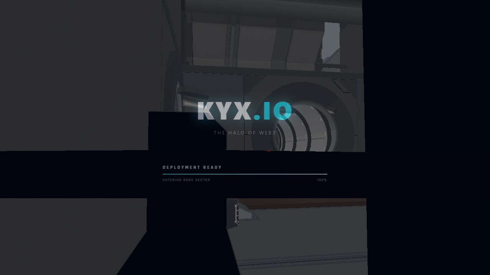
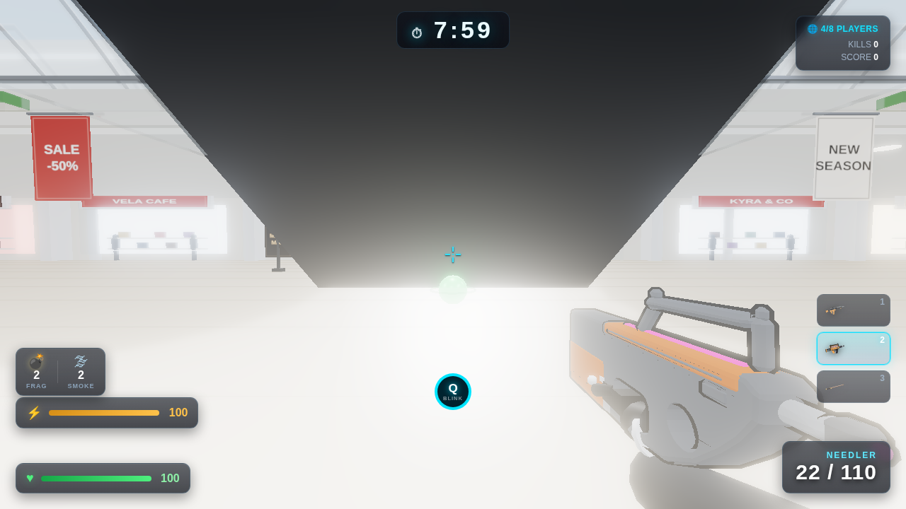
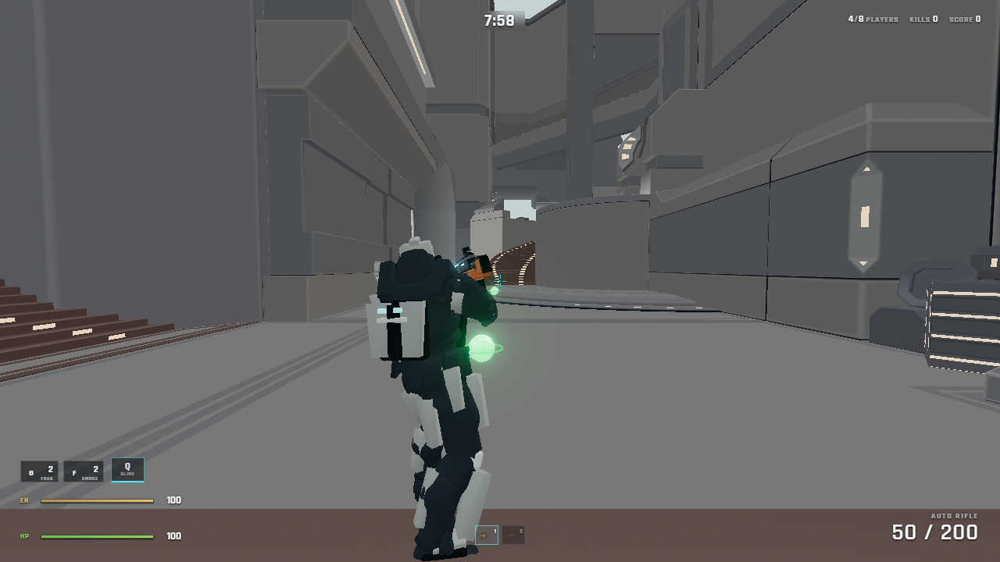
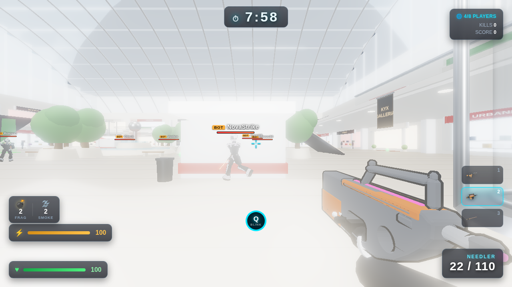

# KYX.IO

A browser arena FPS built with [Three.js](https://threejs.org/) and Vite. No
plugin, no download — it runs in a tab.

Live at **[kryx.live](https://kryx.live)**, deployed automatically on every push
to `main`.

| | |
|---|---|
|  |  |
| *Menu — the arena fly-through* | *Free For All, first person* |
|  |  |
| *Third person — the same rig other players see* | *An opponent on the concourse* |

These are captured from a real match, not mocked up. Regenerate them after any
visual change:

```bash
npx vite --port 5994 --host 127.0.0.1 --strictPort &
node tools/screenshots.mjs
```

---

## Run it

```bash
npm install
npm run dev          # http://localhost:5173
npm run build        # → dist/  (base: './', works from any web root)
```

| script | what it does |
|---|---|
| `npm run dev` | Vite dev server |
| `npm run build` | production build into `dist/` |
| `npm run test:move` | 10 movement fixtures — deterministic, exact hashes |
| `npm run arena:metrics` | bot-driven route times + occupancy for the graybox arena |
| `npm run stress:soak` | server tick-budget matrix at 8/16/32/64 players |
| `npm run certify` | aggregate check |

The standalone match server lives in `server/` and has its own README and test
suite (`npm run test:auth` — 33 authority/abuse proofs).

---

## Playing

| input | action |
|---|---|
| `W` `A` `S` `D` | move |
| `Shift` | sprint (drains stamina) |
| `Space` | jump |
| `Ctrl` / `C` | crouch — hold while sprinting to slide |
| `Q` | blink — a short-range teleport, 5s cooldown |
| `F` / `E` | frag grenade / smoke grenade |
| `R` | reload |
| `Tab` | hold for the scoreboard |
| `Esc` | open the menu without leaving the match |

Base walk is 6.2 m/s, sprint ×1.55. Health and a rechargeable shield, both of
which regenerate after a few seconds out of combat.

## Modes

Five appear in the picker. **Be aware that only two are implemented:**

| mode | state |
|---|---|
| **Free For All** (deathmatch) | implemented — 8 players, continuous 3-minute rounds |
| **Firefight** (survival) | implemented — co-op wave defence, downs and revives |
| Team Slayer | **menu entry only** — runs as deathmatch, no teams |
| Capture the Flag | **menu entry only** — no flags |
| King of the Hill | **menu entry only** — no hill |

The three unimplemented modes are defined in `src/core/GameModes.js` and picked
up by the mode dropdown, but `Game.js` lumps them into the deathmatch branch.

## Arsenal

20 weapons in `src/weapons/weaponDefs.js` — sidearm, uzi, lever shotgun, M4,
M16, rifle, LMG, RPG, bolt sniper, knife, sword, magnum, battle rifle, needler,
plasma rifle, DMR, fuel rod, concussion rifle, energy shotgun, gravity hammer.
Most are Blender-authored GLBs scripted via `bpy` (see `tools/`); a few stay
procedural. You carry one gun and one melee at a time.

---

## How it's put together

```
src/
  core/      main loop, match flow, modes, scoring, settings, audio
  player/    the character: rig, animation, avatars, movement controller
  weapons/   definitions, models, skins, ballistics, viewmodel
  world/     the map — geometry, collision, spawns
  entities/  bots, zombies
  ui/        HUD, menus, nameplates, damage numbers
  sim/       deterministic fixed-tick movement core (shared with the server)
  net/       optional authoritative-multiplayer client
server/      standalone Node/WebSocket match server (deployed separately)
tools/       Blender weapon authoring, metrics, soak tests
```

Two pieces are worth knowing about because they're shared:

- **`src/sim/MoveSim.js`** is a pure, dependency-free movement core at a fixed
  20 Hz. The client predicts with it and the server simulates with it, so both
  agree bit-for-bit. `npm run test:move` locks that down with golden hashes.
- **`src/player/Avatar.js`** renders *any* character from a state struct. Your
  own third-person body and every remote player go through it, so what you see
  of yourself matches what others see of you.

**Multiplayer is built but off by default.** The authoritative server
(`server/authroom.mjs`) does validated movement, lag-compensated hitscan and
server-owned abilities, and it passes 33 abuse proofs — but the shipped game
runs local bots unless you opt in with `?authnet=1`. See `server/README.md`.

---

## Contributing

Several AI agents work in this repo simultaneously. **Read
[`AGENTS.md`](AGENTS.md) before changing anything** — it lists the invariants
that break silently, how to verify a change, and the git rules for a `main`
that more than one author pushes to.

[`CLAUDE.md`](CLAUDE.md) is the deeper project map: what the map is, how the
weapons are authored, and the phase-by-phase history.

[`docs/REFERENCE-EVIO.md`](docs/REFERENCE-EVIO.md) records what we do and don't
actually know about ev.io, the game this one takes inspiration from — worth
reading before implementing anything described as "like ev.io".
